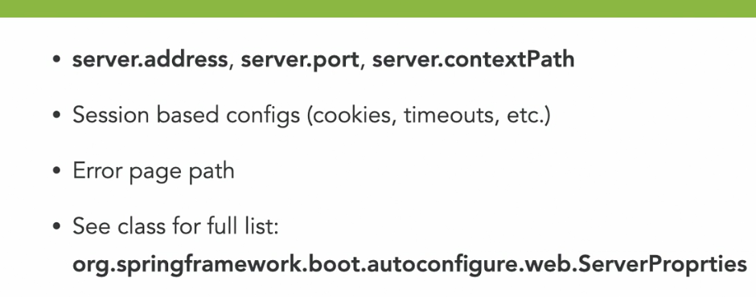
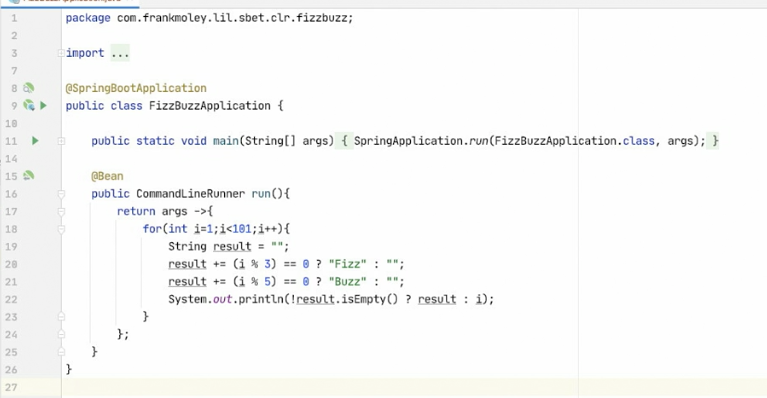

Spring usa Jackson como convertidor -> Marshaller

SLF4J es por defacto la librerìa que logea.

server.compression.enabled = true ??????

TLS ?????????




Spring tiene la opciòn de exponer interfaces gràficas dentro de los controllers.

Basta con crear el archivo html en la carpeta templates, y crear un @Controller,
es decir un archivo java donde se haga referencia


Spring tiene una opcion llamada SpringCommandLineRunner
Ej:



## Paginación

Para pagina bastará con que nuestro repositorio extienda de JpaRepository o PagingAndSortingRepository.

Cont alguna de estas dos interfaces usadas en nuestro repositorio, el siguiente pasó será que nuestros métodos que retornen 
una lista de datos, cambiarles la firma de esto _List<T>_ a _Page<T>_ No obstante, adicional a los parámetros ya creados
Añadirle _Pageable_.
Ver _**PersonRepository.java**_


RestController directamente al repositorio. **_@RepositoryRestResource_**

Usando _@RestResource_ en cada método spring automaticamente expondrá el método a un servicio.
Observar el link https://www.arquitecturajava.com/repositoryrestresource-y-spring-framework/

## Documentation

Con esta dependencia, todos nuestros servicios web quedan documentados automaticamente.
```
<dependency>
    <groupId>org.springframework.data</groupId>
    <artifactId>spring-data-rest-hal-browser</artifactId>
    <version>3.3.9.RELEASE</version>
</dependency>
```

Para ver el funcionamiento solo será necesario iniciar la aplicación como localhost con el puerto configurado.
ejemplo:

`http://localhost:8080/browser/index.html#/
`

## Actuator
Actuator es una herramienta que nos permite ver el estado y propiedades del servicio actual.
Actuator expone endpoints que retornan Json con la información.
Por defecto Actuator solo tiene activados 3 endpoints.
Para activarlos todos bastará con tener estas propiedades:

```
management.endpoints.web.exposure.include=*
#management.endpoints.web.exposure.exclude=env,beans
management.endpoint.shutdown.enabled=true
management.endpoint.env.enabled=true
```
_Nota: Configuración creada para un archivo **.properties**_

Como se observa la primera linea significa que activará todos los endpoints que actuator expone.
La segunda línea (Comentada) dice que excluya informacioń de _env_ y de _beans_
La tercera y cuarta línea hacen referencia a que los endpoints shtdown y env serán activados individualmente.

_Nota2: La tercera y cuarta linea en **este caso en específico** pueden ser **omitidas** ya que estas configuraciones están expuestas **por defecto en la linea 1**._

## Query Creation

Spring por defecto trae muchas consultas o la forma de crearlas, sin la necesidad de usar el lenguaje SQL, bastará con 
tener la escritura correcta y el framework por si solo hará el trabajo.

[Ver Documentación Oficial](https://docs.spring.io/spring-data/jpa/docs/current/reference/html/#jpa.query-methods.query-creation)

## DOCKER
En la raiz del proyecto está el Respectivo _Dockerfile_ que funciona para este proyecto.

Pasos:
1. Corra este comando
  `sudo docker build -t spring_image .`
2. Luego el comando para correr la imagen
`sudo docker run -d -p 8080:8080 spring_image:latest`

¡Listo! Ahora puedes usar los endpoints. 
